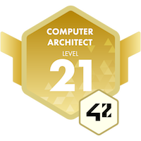

### Hi there 👋

I'm a passionate FullStack developer from France 🇫🇷

**About me**

- 💼 FullStack Engineer at [Les Sherpas](https://sherpas.com/)

- 🕹️ Currently experimenting GameDev, I'm [creating my own tactic game](https://github.com/jeremie-gauthier/dnd)

- 🤖 Interested by [system programming](https://github.com/jeremie-gauthier/shell), blockchain and cryptos

 

|  |  |
| ------------- | ------------- |

